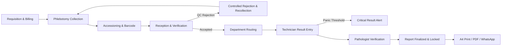

# Walkthrough: Hospital-Grade Laboratory & Diagnostics Hub Master Upgrade

We have upgraded the **Laboratory & Diagnostics Hub** into a strong, hospital-grade, production-ready laboratory management system with end-to-end specimen tracking, accessioning, barcode management, billing integration, technician workbench, pathologist verification, controlled rejection/recollection, real-time Firestore sync, and multichannel report delivery.

---

## Key Achievements & Completed Modules

### 1. Unified Laboratory Data Model & Single Source of Truth
- **Unified Domain**: Eliminated split models between `labmedix_lab_orders_v1` and `labmedix_portal_lab_bookings_v1`. Both now share a unified schema synced directly with Firestore's `labBookings` collection.
- **Dedicated Specimen Architecture (`SpecimenRecord`)**:
  - Unique Accession Number (`ACC-2026-XXXXX`)
  - Dedicated Specimen ID (`SPEC-XXXXXX`)
  - Real barcode string (Code 128 compliant)
  - Traceable status lifecycle: `awaiting_collection` → `collected` → `accessioned` → `received` → `in_analysis` → `rejected` → `recollection_required`.
  - Links directly to Patient, Order, Test, Department, Container Tube, Phlebotomist, and Reception Staff.
- **Firestore Security Rules & Live Sync**:
  - Registered `specimens`, `diagnosticReports`, `laboratory_orders`, and `settings/laboratory` in [firestore.rules](file:///d:/Labmedix.in/firestore.rules) and [apiSyncService.ts](file:///d:/Labmedix.in/src/services/apiSyncService.ts).

---

### 2. Complete Hospital Laboratory Workflow Implemented



1. **Requisition & Billing**:
   - Integrated with `PatientBill`, financial ledger, and discount engine.
   - Built-in double-click submission prevention and duplicate requisition protection.
2. **Specimen Collection (Phlebotomy Station)**:
   - Cap-color guided vacutainer drawer (EDTA Lavender, Plain Red, SST Gold, Fluoride Grey, Citrate Blue, Heparin Green, Sterile Cup).
   - Draw confirmation auto-generates accession number and barcode.
   - Real-time cold-chain temperature monitoring (2°C - 8°C).
3. **Barcode Label Printing & Reprint Protection**:
   - Configurable printer dimensions:
     - `50 × 25 mm` (Standard Vacutainer Tube)
     - `50 × 30 mm` (Standard Lab Tube)
     - `75 × 50 mm` (Transport Bag / Large Aliquot)
     - `38 × 19 mm` (Pediatric / Cryovial)
   - Real Code128 vector barcode and verification QR code.
   - **Reprint Protection**: When reprinting, displays an alert, requires selecting/entering a clinical reason, increments `labelPrintCount`, and records an audit log without creating duplicate specimens.
4. **Specimen Reception & Identifier Verification**:
   - 4-point safety checklist:
     1. Patient Identity verified (Name, Age, Gender)
     2. Requested Investigation matches requisition
     3. Appropriate container / vacutainer tube confirmed
     4. Specimen tube barcode clearly readable and intact
   - Controlled rejection with mandatory clinical reasons (`Gross Hemolysis`, `QNS`, `Clotted`, `Mislabeled`, `Incorrect container`, etc.).
   - Linked urgent recollection workflow that preserves previous specimen history.
5. **Technician Result Entry**:
   - Multi-parameter entry supporting numeric, qualitative (Positive/Negative, Reactive/Non-Reactive), and text findings.
   - Reference range evaluation engine: flags `normal`, `low`, `high`, and `critical`.
   - Supports **Save as Draft** vs. **Submit for Verification**.
6. **Critical Results Alert Console**:
   - Flags life-critical panic values (e.g. Glucose < 45 or > 450 mg/dL, Potassium < 2.8 or > 6.5 mEq/L, Platelets < 20,000/mcL).
   - Dedicated modal to document telephonic notification to ordering doctor with action notes.
7. **Authorized Pathologist Verification & Immutable Locking**:
   - Pathologist signs off with digital signature, council registration number, and clinical impression.
   - Report is locked with dynamic report number `LMDX-RPT-2026-XXXXXX` and verification QR code.
   - Controlled legal amendment workflow via `ReportAmendmentModal` with preserved historical audit.
8. **Real-Time Laboratory Dashboard (100% Calculated, Zero Fake Data)**:
   - Today's Orders, Pending Orders, Awaiting Collection, Collected, Awaiting Reception, In Analysis, Verification Pending, Finalized Reports, Critical Results, Recollections Required, Rejected Specimens, and Department Workload.
   - Real-time Turnaround Time (TAT) monitoring: `Within TAT`, `Approaching TAT` (<60m left), `TAT Delayed`.

---

## Modified & Newly Created Files

| File | Change | Description |
|---|---|---|
| [src/types/index.ts](file:///d:/Labmedix.in/src/types/index.ts) | Modified | Added `SpecimenRecord`, `SpecimenStatus`, `SpecimenRejectionReason`, `PrinterLabelFormat`, `LaboratorySettings`, and enriched `LabOrderStatus` with all 14 hospital workflow statuses. |
| [src/services/laboratoryService.ts](file:///d:/Labmedix.in/src/services/laboratoryService.ts) | Modified | Hospital-grade service with specimen accessioning, barcode generation, controlled rejection, recollection linkage, technician draft/submit, critical alert detection, TAT engine, and audit logging. |
| [src/services/apiSyncService.ts](file:///d:/Labmedix.in/src/services/apiSyncService.ts) | Modified | Added `specimens`, `diagnosticReports`, and `settings/laboratory` to `STORAGE_MAP` and real-time subscribers. |
| [firestore.rules](file:///d:/Labmedix.in/firestore.rules) | Modified | Added security rules for `/specimens`, `/diagnosticReports`, `/laboratory_orders`, `/settings`. |
| [src/components/laboratory/SpecimenReceptionModal.tsx](file:///d:/Labmedix.in/src/components/laboratory/SpecimenReceptionModal.tsx) | **NEW** | Barcode scan check-in, 4-point safety verification checklist, acceptance, controlled rejection with mandatory reason, and recollection initiation. |
| [src/components/laboratory/SpecimenLabelPrinterModal.tsx](file:///d:/Labmedix.in/src/components/laboratory/SpecimenLabelPrinterModal.tsx) | **NEW** | Thermal label printer modal with 4 standard dimensions, Code128 barcode, QR code, and audit-protected reprint workflow. |
| [src/components/laboratory/CriticalResultActionModal.tsx](file:///d:/Labmedix.in/src/components/laboratory/CriticalResultActionModal.tsx) | **NEW** | Documenting urgent clinical notification to prescribing doctor on critical/panic findings. |
| [src/components/laboratory/ReportAmendmentModal.tsx](file:///d:/Labmedix.in/src/components/laboratory/ReportAmendmentModal.tsx) | **NEW** | Controlled legal report amendment preserving prior analytical parameters and recording clinical justification. |
| [src/components/laboratory/CreateLabOrderModal.tsx](file:///d:/Labmedix.in/src/components/laboratory/CreateLabOrderModal.tsx) | Modified | Unified with `LaboratoryService`, preventing duplicate orders and linking to patient billing. |
| [src/components/laboratory/LabResultEntryModal.tsx](file:///d:/Labmedix.in/src/components/laboratory/LabResultEntryModal.tsx) | Modified | Multi-parameter workbench, auto-flagging, Save as Draft vs. Submit for Verification, and panic value detection. |
| [src/pages/laboratory/LaboratoryPage.tsx](file:///d:/Labmedix.in/src/pages/laboratory/LaboratoryPage.tsx) | Modified | Comprehensive 16-view operational layout matching Section 36 with real-time counters, queue filters, phlebotomy station, accessioning, TAT monitoring, and longitudinal patient lab history. |

---

## Verification Results

1. **TypeScript Type Check**:
   ```bash
   npm run typecheck
   # Output: tsc --noEmit (Exit code 0, 0 errors)
   ```
2. **Production Build**:
   ```bash
   npm run build
   # Output: vite build (Exit code 0, built in 18.10s)
   ```
