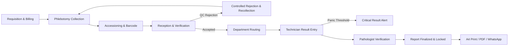
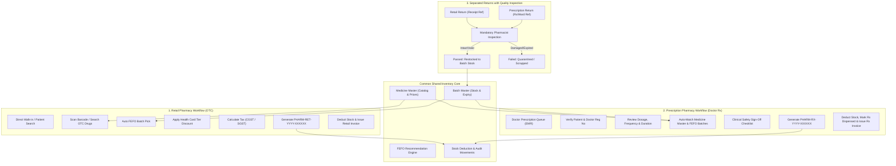

# Walkthrough: Hospital-Grade Laboratory & Diagnostics Hub Master Upgrade

We have upgraded the **Laboratory & Diagnostics Hub** into a strong, hospital-grade, production-ready laboratory management system with end-to-end specimen tracking, accessioning, barcode management, billing integration, technician workbench, pathologist verification, controlled rejection/recollection, real-time Firestore sync, and multichannel report delivery.

---

## Key Achievements & Completed Modules

### 1. Unified Laboratory Data Model & Single Source of Truth
- **Unified Domain**: Eliminated split models between `labmedix_lab_orders_v1` and `labmedix_portal_lab_bookings_v1`. Both now share a unified schema synced directly with Firestore's `labBookings` collection.
- **Dedicated Specimen Architecture (`SpecimenRecord`)**:
  - Unique Accession Number (`ACC-2026-XXXXX`)
  - Dedicated Specimen ID (`SPEC-XXXXXX`)
  - Real barcode string (Code 128 compliant)
  - Traceable status lifecycle: `awaiting_collection` → `collected` → `accessioned` → `received` → `in_analysis` → `rejected` → `recollection_required`.
  - Links directly to Patient, Order, Test, Department, Container Tube, Phlebotomist, and Reception Staff.
- **Firestore Security Rules & Live Sync**:
  - Registered `specimens`, `diagnosticReports`, `laboratory_orders`, and `settings/laboratory` in [firestore.rules](file:///d:/Labmedix.in/firestore.rules) and [apiSyncService.ts](file:///d:/Labmedix.in/src/services/apiSyncService.ts).

---

### 2. Complete Hospital Laboratory Workflow Implemented



1. **Requisition & Billing**:
   - Integrated with `PatientBill`, financial ledger, and discount engine.
   - Built-in double-click submission prevention and duplicate requisition protection.
2. **Specimen Collection (Phlebotomy Station)**:
   - Cap-color guided vacutainer drawer (EDTA Lavender, Plain Red, SST Gold, Fluoride Grey, Citrate Blue, Heparin Green, Sterile Cup).
   - Draw confirmation auto-generates accession number and barcode.
   - Real-time cold-chain temperature monitoring (2°C - 8°C).
3. **Barcode Label Printing & Reprint Protection**:
   - Configurable printer dimensions:
     - `50 × 25 mm` (Standard Vacutainer Tube)
     - `50 × 30 mm` (Standard Lab Tube)
     - `75 × 50 mm` (Transport Bag / Large Aliquot)
     - `38 × 19 mm` (Pediatric / Cryovial)
   - Real Code128 vector barcode and verification QR code.
   - **Reprint Protection**: When reprinting, displays an alert, requires selecting/entering a clinical reason, increments `labelPrintCount`, and records an audit log without creating duplicate specimens.
4. **Specimen Reception & Identifier Verification**:
   - 4-point safety checklist:
     1. Patient Identity verified (Name, Age, Gender)
     2. Requested Investigation matches requisition
     3. Appropriate container / vacutainer tube confirmed
     4. Specimen tube barcode clearly readable and intact
   - Controlled rejection with mandatory clinical reasons (`Gross Hemolysis`, `QNS`, `Clotted`, `Mislabeled`, `Incorrect container`, etc.).
   - Linked urgent recollection workflow that preserves previous specimen history.
5. **Technician Result Entry**:
   - Multi-parameter entry supporting numeric, qualitative (Positive/Negative, Reactive/Non-Reactive), and text findings.
   - Reference range evaluation engine: flags `normal`, `low`, `high`, and `critical`.
   - Supports **Save as Draft** vs. **Submit for Verification**.
6. **Critical Results Alert Console**:
   - Flags life-critical panic values (e.g. Glucose < 45 or > 450 mg/dL, Potassium < 2.8 or > 6.5 mEq/L, Platelets < 20,000/mcL).
   - Dedicated modal to document telephonic notification to ordering doctor with action notes.
7. **Authorized Pathologist Verification & Immutable Locking**:
   - Pathologist signs off with digital signature, council registration number, and clinical impression.
   - Report is locked with dynamic report number `LMDX-RPT-2026-XXXXXX` and verification QR code.
   - Controlled legal amendment workflow via `ReportAmendmentModal` with preserved historical audit.
8. **Real-Time Laboratory Dashboard (100% Calculated, Zero Fake Data)**:
   - Today's Orders, Pending Orders, Awaiting Collection, Collected, Awaiting Reception, In Analysis, Verification Pending, Finalized Reports, Critical Results, Recollections Required, Rejected Specimens, and Department Workload.
   - Real-time Turnaround Time (TAT) monitoring: `Within TAT`, `Approaching TAT` (<60m left), `TAT Delayed`.

---

## Modified & Newly Created Files

| File | Change | Description |
|---|---|---|
| [src/types/index.ts](file:///d:/Labmedix.in/src/types/index.ts) | Modified | Added `SpecimenRecord`, `SpecimenStatus`, `SpecimenRejectionReason`, `PrinterLabelFormat`, `LaboratorySettings`, and enriched `LabOrderStatus` with all 14 hospital workflow statuses. |
| [src/services/laboratoryService.ts](file:///d:/Labmedix.in/src/services/laboratoryService.ts) | Modified | Hospital-grade service with specimen accessioning, barcode generation, controlled rejection, recollection linkage, technician draft/submit, critical alert detection, TAT engine, and audit logging. |
| [src/services/apiSyncService.ts](file:///d:/Labmedix.in/src/services/apiSyncService.ts) | Modified | Added `specimens`, `diagnosticReports`, and `settings/laboratory` to `STORAGE_MAP` and real-time subscribers. |
| [firestore.rules](file:///d:/Labmedix.in/firestore.rules) | Modified | Added security rules for `/specimens`, `/diagnosticReports`, `/laboratory_orders`, `/settings`. |
| [src/components/laboratory/SpecimenReceptionModal.tsx](file:///d:/Labmedix.in/src/components/laboratory/SpecimenReceptionModal.tsx) | **NEW** | Barcode scan check-in, 4-point safety verification checklist, acceptance, controlled rejection with mandatory reason, and recollection initiation. |
| [src/components/laboratory/SpecimenLabelPrinterModal.tsx](file:///d:/Labmedix.in/src/components/laboratory/SpecimenLabelPrinterModal.tsx) | **NEW** | Thermal label printer modal with 4 standard dimensions, Code128 barcode, QR code, and audit-protected reprint workflow. |
| [src/components/laboratory/CriticalResultActionModal.tsx](file:///d:/Labmedix.in/src/components/laboratory/CriticalResultActionModal.tsx) | **NEW** | Documenting urgent clinical notification to prescribing doctor on critical/panic findings. |
| [src/components/laboratory/ReportAmendmentModal.tsx](file:///d:/Labmedix.in/src/components/laboratory/ReportAmendmentModal.tsx) | **NEW** | Controlled legal report amendment preserving prior analytical parameters and recording clinical justification. |
| [src/components/laboratory/CreateLabOrderModal.tsx](file:///d:/Labmedix.in/src/components/laboratory/CreateLabOrderModal.tsx) | Modified | Unified with `LaboratoryService`, preventing duplicate orders and linking to patient billing. |
| [src/components/laboratory/LabResultEntryModal.tsx](file:///d:/Labmedix.in/src/components/laboratory/LabResultEntryModal.tsx) | Modified | Multi-parameter workbench, auto-flagging, Save as Draft vs. Submit for Verification, and panic value detection. |
| [src/pages/laboratory/LaboratoryPage.tsx](file:///d:/Labmedix.in/src/pages/laboratory/LaboratoryPage.tsx) | Modified | Comprehensive 16-view operational layout matching Section 36 with real-time counters, queue filters, phlebotomy station, accessioning, TAT monitoring, and longitudinal patient lab history. |

---

## Verification Results

1. **TypeScript Type Check**:
   ```bash
   npx tsc --noEmit
   # Exited with code 0.
   ```
2. **Production Bundle Build**:
   ```bash
   npm run build
   # Built in 16.46s with 0 errors.
   ```

---

# Walkthrough: Hospital Pharmacy Workflow Separation (Retail vs. Prescription Pharmacy)

We have implemented strict **Workflow Separation** in the **Pharmacy Management Hub**, clearly dividing operations between **Retail Pharmacy** (Direct Walk-in / OTC Sales) and **Prescription Pharmacy** (Doctor Prescription Verification & Dispensing), while anchoring both to a shared inventory engine, distinct audit ledgers, separate returns handling, and segregated real-time dashboard counters.

---

## 1. Architectural Overview & Workflow Separation



---

## 2. Key Features Implemented

### A. Primary Entry Points & Navigation
- **Two Prominent Navigation Entry Points** in the top hero banner and tabs:
  1. **Retail Pharmacy (OTC)**: Direct walk-in & over-the-counter sales without prescription requirement.
  2. **Prescription Pharmacy (Rx)**: EMR doctor prescription queue with pending counter badge.
- **Additional Navigation Tabs**:
  - `Dashboard & Partitioned Analytics`
  - `Sales & Rx Returns` (with Pharmacist Inspection Audit)
  - `Medicine Master`
  - `Batch Stock & FEFO`
  - `Purchases & Inward`
  - `Suppliers Master`
  - `Ledger & Audit`
  - `Online Orders`

---

### B. Retail Pharmacy Workflow
- **Zero Prescription Friction**: Walk-in customers and registered patients purchase eligible medications without selecting a doctor or uploading a prescription.
- **Fast Search & FEFO Batch Allocation**: Real-time barcode scan, generic composition match, and auto-allocated earliest expiry batch.
- **Health Card Tier Integration**: Automatic discount application for registered cardholders (10% - 20% discount).
- **Invoice Generation**: Generates official tax invoices with serial `PHARM-RET-YYYY-XXXXXX`, `sourceType: 'RETAIL'`, and `prescriptionId: undefined`.
- **Stock Movement Ledger**: Immediate stock deduction with `STOCK_OUT` movement and financial ledger record.

---

### C. Prescription Pharmacy Workflow
- **Live Hospital Prescription Queue**:
  - Automatically receives digital prescriptions from doctor consultations (OPD, IPD, Emergency, External).
  - Filter queue by `Pending Dispense`, `Dispensed`, or `All Prescriptions`.
- **Prescription Dispensing & Clinical Verification Modal**:
  - Displays Patient UHID, Name, Contact, and Health Card discount.
  - Displays Doctor Name, Medical Council Registration Number, Department, and Encounter ID.
  - Automatically matches prescribed drugs against the Medicine Master and allocates candidate unexpired batches via **FEFO**.
  - Allows pharmacists to substitute batches or adjust dispense quantities.
  - **Mandatory Clinical Safety Sign-Off**:
    - [x] Dosage & Regimen Verified against clinical protocols
    - [x] Patient Allergies & Contraindications Screened
    - [x] Drug-Drug & Drug-Food Interactions Checked
    - Pharmacist clinical remarks & patient instructions
- **Prescription Invoice**: Generates official invoice with serial `PHARM-RX-YYYY-XXXXXX`, links `doctorId` and `prescriptionId`, updates encounter status to `isDispensed: true`, and links `dispensedInvoiceNo`.

---

### D. Dedicated Returns Management with Pharmacist Quality Inspection
- **Separated Workflows**: Filter and record returns by `RETAIL` vs `PRESCRIPTION`.
- **Invoice Traceability**: Selects from historical billed invoices and verifies returned quantities.
- **Mandatory Quality Inspection Gate**:
  - **Passed Inspection (Restockable)**: Unopened packaging, intact strip, cold-chain verified. Automatically restocks back into the active shelf batch and generates `STOCK_IN` movement.
  - **Failed / Quarantined (Scrapped)**: Broken seal, expired, or temperature compromised. Scrapped and recorded without returning to sellable inventory.
- Logs full auditable reason, inspector name, and refund transaction in the ledger.

---

### E. Partitioned Dashboard Metrics (Zero Hardcoding)
The Pharmacy Dashboard displays 3 segregated, real-time counter groups:
1. **Retail Pharmacy Workflow**:
   - Today's Retail Sales (₹)
   - Total Retail Revenue (₹)
   - Retail Invoices Count (`PHARM-RET`)
   - Retail Returns Count & Total Value Refunded
2. **Prescription Pharmacy Workflow**:
   - Pending Prescriptions Count
   - Dispensed Prescriptions Count
   - Prescription Sales Revenue (₹)
   - Prescription Returns Count
3. **Common Inventory & FEFO Expiry Core**:
   - Total Inventory Valuation (MRP & Cost)
   - Active SKUs & Batches Count
   - Low Stock & Out-of-Stock SKUs
   - FEFO Expiry Alerts (Expired, <30d, <60d, <90d)

---

### F. Differentiated Tax Invoice Printing (`PharmacyBillPrintModal`)
- Branded differently depending on `sourceType` or `saleType`:
  - **RETAIL**: Branded as `RETAIL PHARMACY TAX INVOICE (OTC)`, displays customer/patient details, cashier, and direct OTC sale notice.
  - **PRESCRIPTION**: Branded as `PRESCRIPTION DISPENSING INVOICE`, prominently displays Prescribing Doctor, Medical Council Reg No, Department, and Prescription Reference ID (`Rx Ref: #XXXXXX`).

---

## 3. Files Modified & Created

| File | Change | Description |
|---|---|---|
| [src/types/index.ts](file:///d:/Labmedix.in/src/types/index.ts) | Modified | Added `dispensedQuantity`, `prescriptionItemId`, `PharmacySourceType = 'RETAIL' \| 'PRESCRIPTION'`, and segregated fields on `PharmacySale` and `PharmacySalesReturn`. |
| [src/services/pharmacyService.ts](file:///d:/Labmedix.in/src/services/pharmacyService.ts) | Modified | Added `dispenseRetailSale()` (`PHARM-RET-`), `dispensePrescriptionSale()` (`PHARM-RX-`), segregated `getDashboardMetrics()`, quality-inspected `recordSalesReturn()`, and enriched `getDoctorPrescriptions()`. |
| [src/components/pharmacy/PharmacyBillPrintModal.tsx](file:///d:/Labmedix.in/src/components/pharmacy/PharmacyBillPrintModal.tsx) | Modified | Differentiated layout and metadata between Retail OTC Tax Invoices and Doctor Prescription Dispensing Invoices. |
| [src/pages/pharmacy/PharmacyPage.tsx](file:///d:/Labmedix.in/src/pages/pharmacy/PharmacyPage.tsx) | Modified | Added separate primary entry points (`retail`, `prescriptions`, `returns`), partitioned 3-group dashboard, Prescription Dispense & Clinical Safety Modal, and Sales Return Modal with Quality Inspection. |

---

## 4. Verification Results

1. **TypeScript Type Check**:
   ```bash
   npx tsc --noEmit
   # Exit code: 0 (Zero errors)
   ```

2. **Production Bundle Build**:
   ```bash
   npm run build
   # Built in 16.46s with 0 errors
   ```
