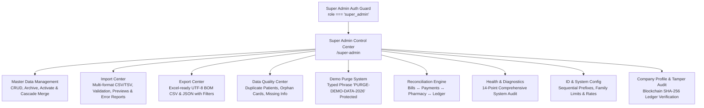

# Walkthrough: LabMedix Super Admin Data & System Control Center & Retail Pharmacy POS

We have implemented the dedicated, sovereign **Super Admin Data & System Control Center** and the **Hospital-Grade Retail Pharmacy POS & A4 Half-Page Invoice System** in LabMedix.

---

## 1. Super Admin Data & System Control Center

### Security & Architecture
- **Super Admin Exclusive**: Only users with `role === 'super_admin'` can view or access this module.
- **Frontend Enforcement**: Gated via `<SuperAdminGuard>`, in [App.tsx](file:///d:/Labmedix.in/src/App.tsx), and in [Sidebar.tsx](file:///d:/Labmedix.in/src/components/layout/Sidebar.tsx). Unauthorized attempts result in an HTTP 403 screen and are automatically recorded in the tamper-evident security audit log.
- **Centralized Engine**: [superAdminService.ts](file:///d:/Labmedix.in/src/services/superAdminService.ts) provides sovereign controls across the entire system.

---

### Core Super Admin Capabilities

#### 1. Master Data Management & Cascade Patient Merge
- **Datasets Managed**: Patients, Health Cards, Family Members, Doctors, Staff, Medicines, Lab Test Master, Suppliers, Packages, Services.
- **Full Operational Lifecycle**: Add, View, Edit, Activate, Deactivate, Archive, Restore.
- **Patient Duplicate Detection & Cascade Merge**:
  - Automatically identifies duplicate patients by mobile phone or name similarity.
  - **Cascade Merge**: Select Target Primary Patient and Secondary Duplicate.
  - Re-links all Health Cards, Family Members, Bills, Lab Orders, and Appointments from the secondary record to the primary record.
  - Safely archives the secondary record with cross-reference pointers.
  - Fully recorded in the audit trail.

#### 2. Health Card & Family Member Controls
- **Lifecycle Status Management**: `pending → approved → issued → active → suspended/expired → renewed/archived`.
- **Family Member Safeguards**:
  - Enforces strict maximum 5 family members per primary health card.
  - Addition beyond 5 requires explicit Super Admin override approval.
  - Independent status tracking per family member.
  - Clarified policy: family members do not automatically generate independent physical cards without distinct registration.

#### 3. Enterprise Import Center
- **Supported Datasets**: Patients, Doctors, Medicines, Lab Tests.
- **Downloadable Formats**: Standard CSV templates with field descriptions and sample rows.
- **Two-Pass Client-side Validation**:
  - Mandatory fields, phone numbers (10 digits), positive numbers, date formats (`YYYY-MM-DD`).
  - Previews categorized as: **Valid Records**, **Invalid / Errored**, **Existing Duplicates**, **Skipped**.
- **Downloadable Error Reports**: Generates an error report (`Row | Field | Error | Suggested Action`) for invalid rows.
- **Atomic Batch Commit**: Commits valid records with simulated or direct Firestore batch writes.

#### 4. Excel-Ready Export Center
- **UTF-8 BOM Header (`\uFEFF`)**: Direct double-click compatibility in Microsoft Excel without character corruption or messy encoding.
- **Datasets**: Patients, Health Cards, Billing & Invoices, Pharmacy Sales, Financial Transactions, Audit Logs.
- **Export Filters**: Date ranges, Status, Module, Doctor, Payment Method.
- **Formats**: CSV and formatted JSON.

#### 5. Safe Demo Data Purge System
- **Accidental Deletion Prevention**:
  - Only purges explicitly tagged demo records (`environment === 'DEMO'`, `recordType === 'DEMO'`, or `isDemo === true`).
  - Genuine production records are strictly shielded from deletion.
- **Pre-Purge Impact Analysis**:
  - Live breakdown displaying demo record counts across Patients, Cards, Bills, Pharmacy Sales, and Transactions.
- **Double Confirmation**:
  - Requires the Super Admin to type the exact security phrase: `PURGE-DEMO-DATA-2026`.
  - Action is logged in the permanent audit trail with timestamp and admin identity.

#### 6. Data Quality & Anomaly Scanner
- **One-Click Audit**:
  - Identifies duplicate patients by phone number.
  - Identifies orphan health cards with missing primary patient profiles.
  - Identifies duplicate medicine entries by generic brand/strength.
  - Detects patients with missing vital demographics (DOB, Gender, Address).
- **Direct Resolution**: Quick action buttons to merge duplicates or edit records.

#### 7. Multi-Ledger Transaction Reconciliation
- Cross-matches Patient Bills ↔ Payments ↔ Central Ledger ↔ Retail Pharmacy Sales.
- Detects discrepancies:
  - Unbalanced bills where sum of recorded payments does not match bill net amount.
  - Orphan transactions without corresponding billing parent records.
  - Mismatched status flags (e.g. `paymentStatus === 'paid'` with outstanding balance).
- Summary metrics: Total Audited, Balanced, Discrepancies, Total Variance (₹).

#### 8. 14-Point Live Diagnostics
1. Firestore Database Connectivity
2. Offline Storage Integrity (IndexedDB / LocalStorage)
3. Audit Log Blockchain Immutability
4. Demo Data Contamination Check
5. Transaction Reconciliation Health
6. Data Quality & Duplicate Health
7. Health Card Quota & Family Caps
8. Unbalanced Bills Check
9. Orphan Health Cards Scan
10. Unpaid Invoices Aging Check
11. Expired Medicine Batches Audit
12. Low Stock Alerts Scan
13. Storage Quota & Capacity Check
14. System Configuration Integrity

#### 9. System Configuration & ID Prefix Management
- Centralized configuration for sequential numbering prefixes:
  - Patient UHID: `LM-PT-`
  - Health Card ID: `LHC-`
  - Patient Invoice: `LM-INV-`
  - Pharmacy Invoice: `LM-PH-`
  - Lab Report: `LAB-REP-`
- Configurable family member limits (default: 5) and default GST/Tax rates.
- Company Profile management with Clinical Establishment License No., Drug Licenses (DL 20B/21B), GSTIN, and contact details.

#### 10. Cryptographic Audit Trail
- Blockchain-style immutable SHA-256 block hashing with Merkle tree root verification.
- Searchable by action, module, user, and date range.

---

## 2. Retail Pharmacy POS & A4 Half-Page Invoice System

### Key Capabilities
1. **Standardized A4 Half-Page Invoice**:
   - Exact half-page height (`~140mm - 148.5mm`) on A4 portrait (`210mm × 297mm`).
   - Strict CSS rules `@page { size: A4 portrait; margin: 6mm 8mm; }` prevent overflow.
   - Dynamic branding, sequential number (`LM-PH-YYYY-XXXXXX`), items table with batch/exp/disc/GST, round-off, cash tender, and change return.
   - Distinct duplicate copy option for clinic records on the bottom half of the sheet.
2. **Retail Counter POS UI**:
   - Walk-in, Registered Patient, or Health Card Holder selection.
   - Barcode Scanner input with `Enter-to-Add` shortcut.
   - Live Medicine Master search with auto-suggest and FEFO batch recommendation.
   - Real-time stock limit checks, item-level discounts, and membership tier discounts.
   - Cash payment with instant change calculation and automatic round-off.
3. **Hold Bill Queue**:
   - Cashiers can place in-progress carts on hold without deducting stock or creating ledger entries.
   - Resume or discard anytime from the Held Bills modal.
4. **Reprint & Non-Destructive Cancellation**:
   - Official Reprint counter tracking (`OFFICIAL DUPLICATE / REPRINT #N`) and watermark.
   - Non-destructive cancellation with mandatory reason, authorized supervisor logging, optional inventory restock, and refund ledger entry.
5. **Daily Shift Closing**:
   - Cash drawer reconciliation: Opening Float, Cash Sales, Card/UPI Sales, Returns, Expected Cash vs. Actual Cash Count.
   - Difference calculation (balanced, shortage, excess) with printable shift closing report.

---

## 3. Verification & Build Results

### A. TypeScript Type Check (`npx tsc --noEmit`)
- **Status**: **PASS (0 errors)**
- Clean compilation across all files in the project.

### B. Production Build (`npm run build`)
- **Status**: **PASS (0 errors, built in 21.42s)**
- Generated assets:
  - `dist/assets/SuperAdminControlCenterPage-XKToy2eq.js` (72.92 kB)
  - `dist/assets/PharmacyPage-CQzW-etz.js` (172.93 kB)
  - `dist/assets/pharmacyService-iTZGkidt.js` (47.81 kB)
  - `dist/assets/printService-C0WTao8A.js` (8.10 kB)

---

## 4. Key Files Created / Modified

| File | Description |
|---|---|
| [`src/services/superAdminService.ts`](file:///d:/Labmedix.in/src/services/superAdminService.ts) | Core Super Admin operations engine: Master data CRUD, cascade patient merge, import validator & error report generator, UTF-8 BOM exporter, demo data purge with security phrase, data quality scanner, multi-ledger reconciliation, 14-point diagnostics, and ID/system config. |
| [`src/pages/admin/SuperAdminControlCenterPage.tsx`](file:///d:/Labmedix.in/src/pages/admin/SuperAdminControlCenterPage.tsx) | Sovereign Super Admin UI with 11 functional tabs, manual data editors, cascade merge modal, and live metric indicators. |
| [`src/App.tsx`](file:///d:/Labmedix.in/src/App.tsx) | Lazy-loaded `SuperAdminControlCenterPage` and protected `/super-admin` route using `<SuperAdminGuard>`. |
| [`src/components/layout/Sidebar.tsx`](file:///d:/Labmedix.in/src/components/layout/Sidebar.tsx) | Added "Super Admin Center" navigation item with `ShieldAlert` icon visible strictly when `currentUser?.role === 'super_admin'`. |
| [`src/types/index.ts`](file:///d:/Labmedix.in/src/types/index.ts) | Enriched data types for pharmacy permissions, held bills, shift closings, transactions, and system settings. |
| [`src/services/pharmacyService.ts`](file:///d:/Labmedix.in/src/services/pharmacyService.ts) | Retail pharmacy invoice numbers, cash tender, round-off, hold queue, reprint tracking, cancellation, and shift closing. |
| [`src/services/printService.ts`](file:///d:/Labmedix.in/src/services/printService.ts) | Isolated print window generation for A4 Half-Page Pharmacy bill. |
| [`src/components/pharmacy/PharmacyA4HalfPageInvoice.tsx`](file:///d:/Labmedix.in/src/components/pharmacy/PharmacyA4HalfPageInvoice.tsx) | Standardized A4 Half-Page bill format with company branding, tax breakdown, and duplicate copy support. |
| [`src/components/pharmacy/PharmacyBillPrintModal.tsx`](file:///d:/Labmedix.in/src/components/pharmacy/PharmacyBillPrintModal.tsx) | Bill preview, print, reprint, duplicate copy, and PDF download modal. |
| [`src/components/pharmacy/RetailPosHoldBillsModal.tsx`](file:///d:/Labmedix.in/src/components/pharmacy/RetailPosHoldBillsModal.tsx) | Held bill queue modal for resuming or discarding suspended carts. |
| [`src/components/pharmacy/PharmacyShiftClosingModal.tsx`](file:///d:/Labmedix.in/src/components/pharmacy/PharmacyShiftClosingModal.tsx) | Daily drawer closing and cash reconciliation modal with printable summary slip. |
| [`src/components/pharmacy/PharmacyBillCancelModal.tsx`](file:///d:/Labmedix.in/src/components/pharmacy/PharmacyBillCancelModal.tsx) | Non-destructive bill cancellation modal with audit and inventory restock options. |
| [`src/pages/pharmacy/PharmacyPage.tsx`](file:///d:/Labmedix.in/src/pages/pharmacy/PharmacyPage.tsx) | Complete Retail Pharmacy POS page with customer type selector, barcode scanner, cart, and recent bills. |
